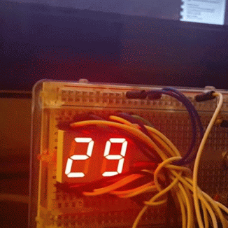

# temp-thing
Things of Temp, uses MLX90614

# Compilation

It is required to download and link the `I2CMaster` library.

`byte numbers[11][7]` is a mapping from `a-f` on a seven-segment display.

Currently we use pins 0-13 for individually addressing each cathode.

# License

[MIT](LICENSE)
